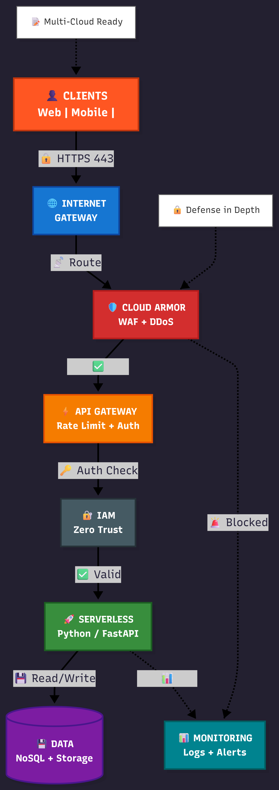

# Serverless API Infrastructure (Multi-Cloud / OCI)

This repository contains the complete Infrastructure-as-Code (IaC) and application logic for a serverless API deployed on Oracle Cloud Infrastructure (OCI). 

Originally designed for Google Cloud Platform (GCP), this project was pivoted to OCI to demonstrate multi-cloud adaptability and strict FinOps (cost-management) boundaries using Oracle's "Always Free" tier.

## 🛠️ Tech Stack

*   **Cloud Provider:** Oracle Cloud Infrastructure (OCI)
*   **Infrastructure-as-Code:** Terraform (`oci` provider)
*   **Compute:** OCI Functions (Serverless)
*   **Containerization:** Docker
*   **API Management:** OCI API Gateway
*   **Application Logic:** Python 3.11 (Fn Project framework)

## 🏗️ Architecture Overview

1.  **Network:** A dedicated Virtual Cloud Network (VCN) with public subnets, internet gateways, and strict security lists (firewalls) allowing only port 443 (HTTPS).
2.  **Compute:** The Python API is packaged in a Docker container and stored in the OCI Container Registry (OCIR). It runs inside a serverless OCI Function, meaning compute resources are only consumed upon invocation.
3.  **Routing:** An OCI API Gateway handles public HTTP routing and forwards requests to the underlying function.
4.  **Security:** A strict "Zero Trust" IAM policy is enforced at the infrastructure level, explicitly granting the API Gateway permission to invoke the serverless function.

## 🚀 Deployment Guide

### Prerequisites
*   An active OCI Account
*   Local installations of `terraform`, `docker`, and `git`
*   OCI API Keys (`.pem` file) and an OCIR Auth Token

### 1. Local Configuration
Clone the repository and set up your local environment variables. **Note:** Ensure your `.pem` key and `terraform.tfvars` remain in `.gitignore` to prevent credential leakage.

```bash
git clone https://github.com/Chinkhuselts/Serverless-API
cd oracle-serverless-api
```
Create a `terraform.tfvars` file in the root directory:

```terraform
user_ocid        = "ocid1.user.oc1..."
tenancy_ocid     = "ocid1.tenancy.oc1..."
fingerprint      = "xx:xx:xx:xx:xx:xx:xx:xx:xx:xx:xx:xx:xx:xx:xx:xx"
region           = "eu-stockholm-1"
private_key_path = "oci-api-key.pem"
```
### 2. Container Registry Push
Build the Python application and push it to your OCI Container Registry.

```bash
cd python-api
docker login <region>.ocir.io
docker build -t <region>.ocir.io/<namespace>/ibm-portfolio/python-api:v1 .
docker push <region>.ocir.io/<namespace>/ibm-portfolio/python-api:v1
```
(Note for Apple Silicon users: Ensure you build with `--platform linux/amd64` to match OCI Function architecture).

### 3. Infrastructure Provisioning
Use Terraform to build the network, gateways, and functions.

```bash
terraform init
terraform plan
terraform apply
```
Upon a successful apply, Terraform will output the live `live_api_url`.

## 🧪 Usage
Once deployed, the API can be invoked via standard HTTP requests. Note that the first request may experience a "cold start" delay of up to 30 seconds as the container provisions.

Request:

```bash
curl -v https://btko5yo6f4hqjdugvzs5upk3ha.apigateway.eu-stockholm-1.oci.customer-oci.com/api/hello
```
Response:

```json
{
  "status": 200, 
  "message": "Hello World! This serverless API was built for the IBM Cloud Developer portfolio.", 
  "tech_stack": ["Oracle Cloud", "Terraform", "Python", "Serverless"]
}
```
## 🧹 Tear Down
To prevent any residual configuration in your OCI environment, the entire architecture can be safely destroyed via Terraform:

```bash
terraform destroy
```
